# READABLE project
Readable is a social book cataloguing website, built using Django, which could be tailored for children, students and adults alike looking for a clean, simple book-browsing experience. Users can explore a catalogue of novels, read synopses and reviews, create an account to leave their own reviews and get in touch to recommend additions.

## User stories
As the project evolved, user stories were ranked to create an MVP, prioritising site navigation and CRUD functionality.
[Kanban board](https://github.com/users/henrytitheridge-stone/projects/5/views/1)

## Database
Here are ERDs for the Book, Review and Recommendation models:
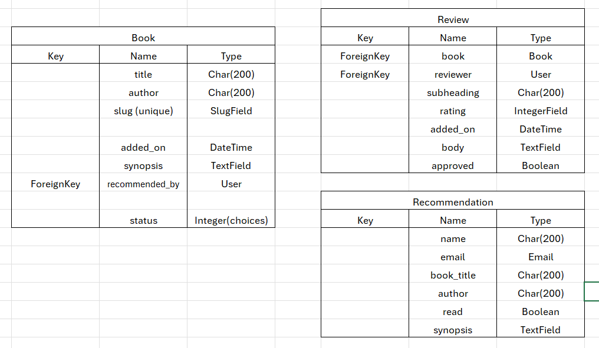

## Design
The overall layout and user journey is adapted from the Code Institute walkthrogh blog example. The 'Poppins' font was chosen as it is clear and modern. In addition to high-contrasting black and white, colours such as 'Harvest Orange' and 'Yale Blue' were used consistently for titles, text, links and buttons. Default bootstrap classes ensured full responsivity. The following wireframes were used as initial outlines which were adapted as the project evolved:

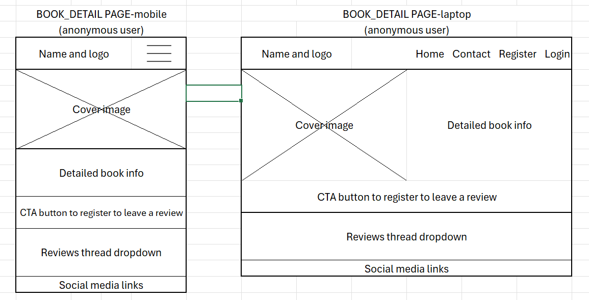
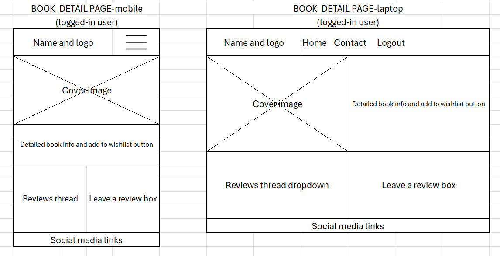
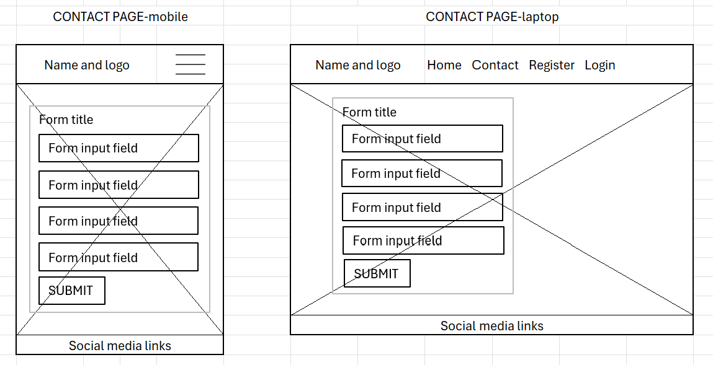

## Features
The navbar includes the site name and links to home, contact, register or login.
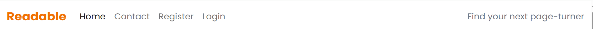
These change to home, contact and logout for logged-in users. The current page link displays in bold.
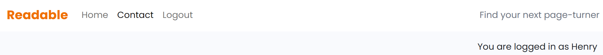
On smaller screens the navbar becomes a dropdown 'burger' menu.

On the homepage, books are listed with their titles, authors and an engaging tagline consisting of a dramatic summary or quote. The book info acts as a link which changes colour when hovered over.

The book detail pages consist of a title banner including the book title and author above a short synopsis. Below this is a count of reviews and for anonymous users, just the review thread.
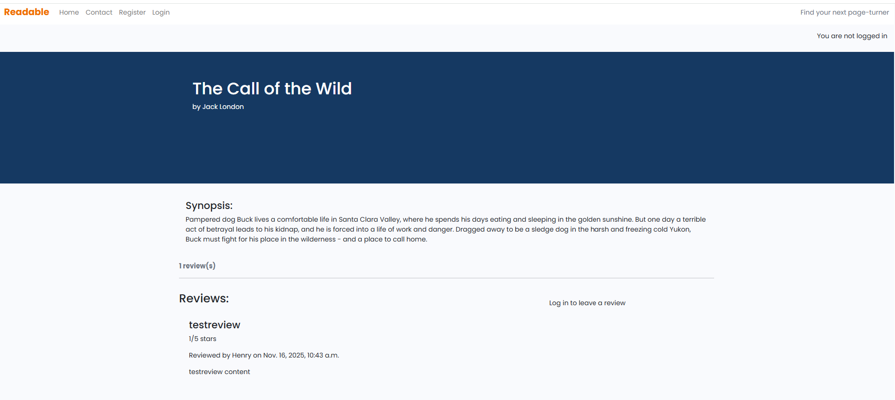

Authenticated users see a review form to leave a review and clear bright 'Edit' and 'Delete' buttons next to their own previous reviews. Once submitted, reviews appear faded in the thread with a pending approval message until the admin has verified them. Reviews include a title, rating out of 5 stars and a body of text.
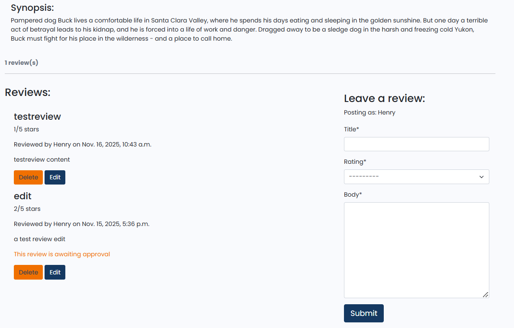

The contact page is comprised of a form for any site user, authenticated or otherwise, to recommend a book title to be added to the database.
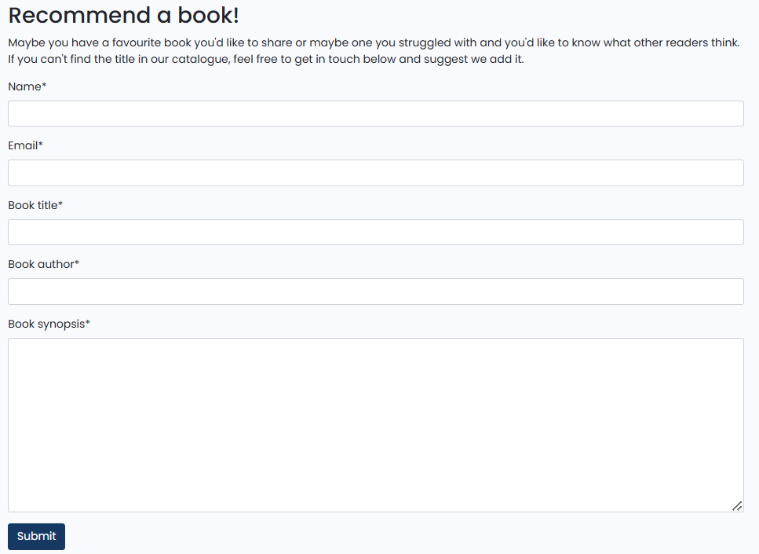

Confirmation messages like this appear for logging in and out, submitting a review and submitting a recommendation.
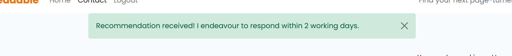

## Manual testing
| Feature area | Test case description | User status | Expected outcome | Result |
| ------------ | --------------------- | ----------- | ---------------- | ------ |
| **Navigation & UI** | Verify all primary navigation links lead to correct pages | Anonymous | Links function correctly, Home, Contact, Register, Login and book pages load as expected | PASS |
| **Navigation & UI** | Check website responsiveness across different screen sizes (mobile, desktop) | Anonymous | Layout adapts correctly without breaking, including dropdown navbar | PASS |
| **Book listings** | Navigate to homepage and verify content displays correctly, including book title, tagline and recommendations | Anonymous | Book data is present and accurate | PASS |
| **Book details** | Access a 'book_detail' page and verify complete details, ie title, author, synopsis, review_count and any reviews are present | Anonymous | All book data and reviews are displayed correctly | PASS |
| **Book details** | Try to leave a review while logged out | Anonymous | Review form hidden and message displayed next to review thread to log in to leave a review | PASS |
| **Recommendation form** | Submit the form with valid data | Anonymous | Success message displayed and data recorded in admin panel | PASS |
| **Recommendation form** | Submit the form with invalid data, ie empty fields or incorrect email format | Anonymous | Appropriate validation error messages appear | PASS |
| **Registration** | Create a new user account with valid credentials, username and password | Anonymous | Instructions displayed, account created successfully, user logged in and status message changed | PASS |
| **Registration** | Attempt registration with invalid password or mismatched confirmation fields | Anonymous | Appropriate validation error messages appear | PASS |
| **Authentication** | Log in with valid credentials | Anonymous | User successfully authenticated, status message changed, 'Register' and 'Login' navbar links are replaced with just 'Logout' | PASS |
| **Authentication** | Attempt login with incorrect password or username | Anonymous | 'The username and/or password you specified are not correct.' message displayed | PASS |
| **Authentication** | Log out from an account | Authenticated | The user is directed to a confirmation page, the button click ends the session and redirects to the homepage with logout and status messages displayed/updated | PASS |
| **Review submission** | Leave a review on a book detail page | Authenticated | Review form displayed next to review thread, including title, rating and body fields; on submission a 'faded' version appears in thread with 'pending approval' message | PASS |
| **Review submission** | Attempt to submit an empty review form | Authenticated | Appropriate validation error messages appear | PASS |
| **User: Review management** | Edit or delete an existing review on the book detail page | Authenticated | Edit and delete buttons present underneath user's own reviews only; content reappears in form fields, approval message reappears on resubmission; or delete confirmation modal directs user and review removed | PASS |  
| **Admin: Review management** | Access and moderate, ie approve or delete submitted reviews from the admin panel | Admin | Reviews are listed in the admin panel, approval or deletion updates the frontend to correctly add or remove the review on the related book_detail page | PASS |
| **Book management** | Add a new book via the Django admin interface | Admin | New book is viewable on the frontend website | PASS |
| **Book management** | Edit an exisiting book's details or delete it completely via the admin interface | Admin | Changes or removals are instantly reflected on the frontend | PASS |
| **Recommendation management** | Verify all submitted recommendation forms are recorded in the admin | Admin | All entries are present and accessible for processing | PASS |

### Validation
#### HTML & CSS
Homepage html validation:
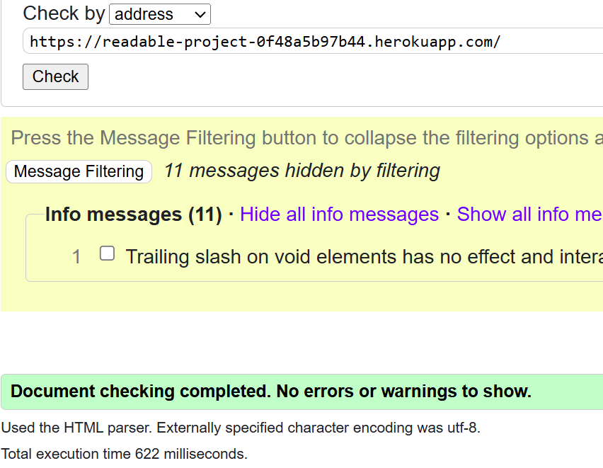
Logged-out book detail html validation:
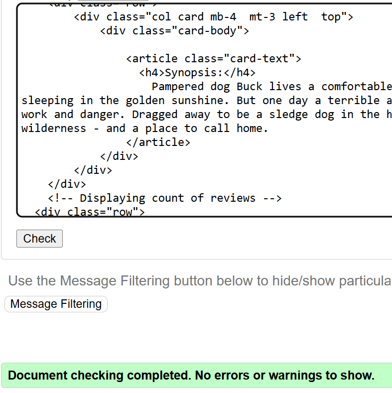
Logged-in book detail html validation:
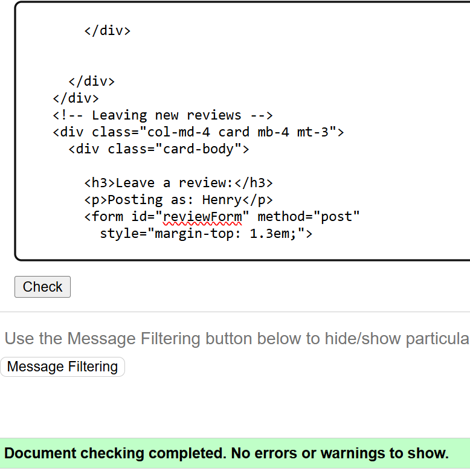
Contact page html validation:
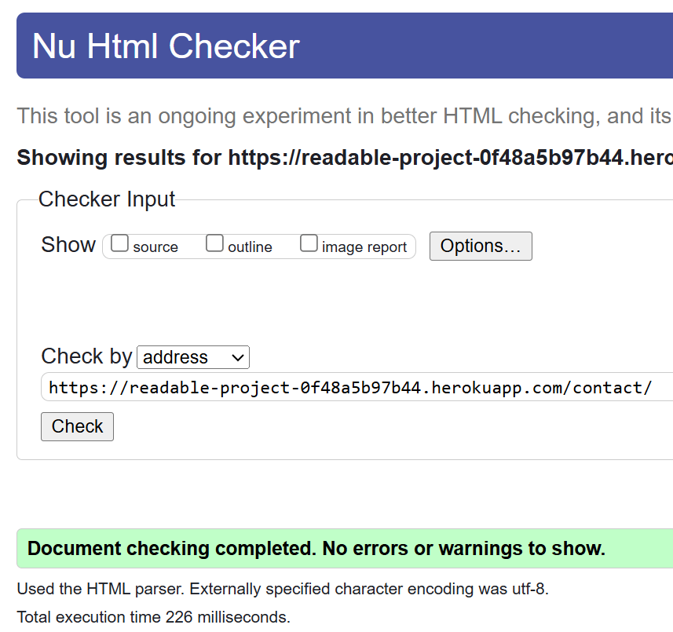
Custom CSS validation:
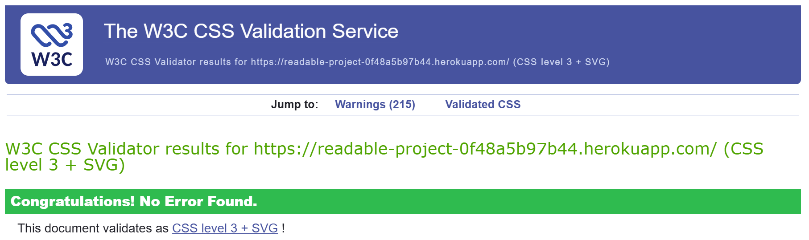
#### JavaScript & Python
- No errors were returned when passing through the official [Jshint validator](https://jshint.com/)
- The following metrics were returned: 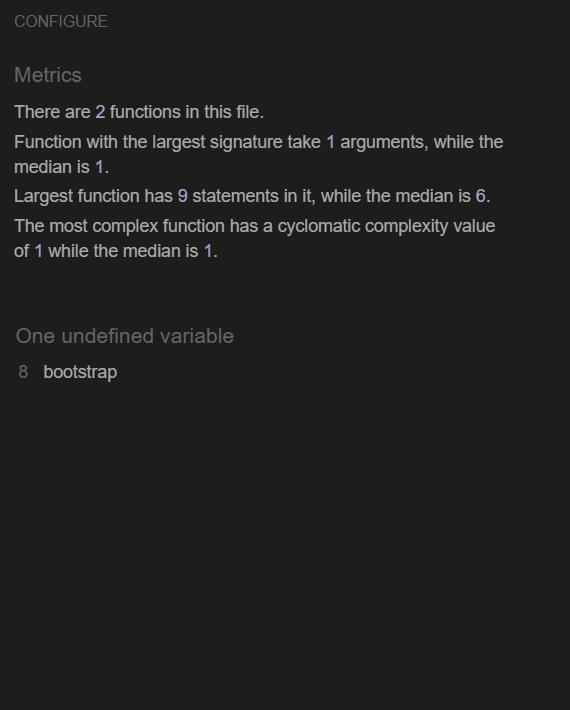
- Using the Flake8 extension in VSCode allowed me to avoid Python linting errors throughout
    - Some 'line too long' errors have been left in the interests of time as they aren't affecting functionality: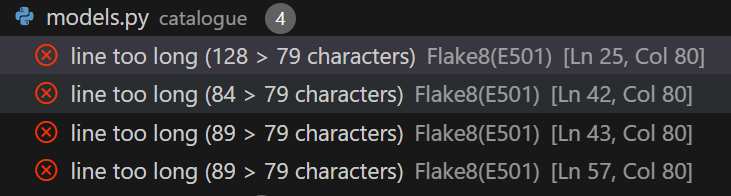
#### Lighthouse scores
Homepage- mobile results:
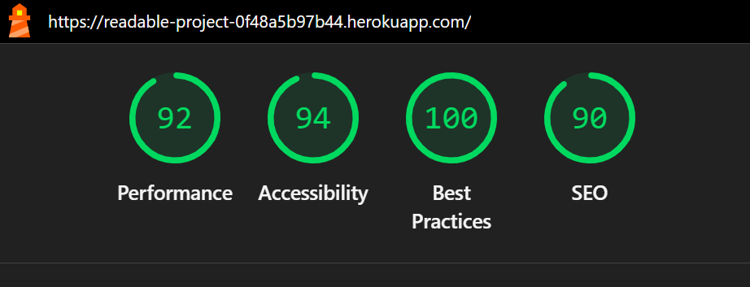
Homepage- desktop results:
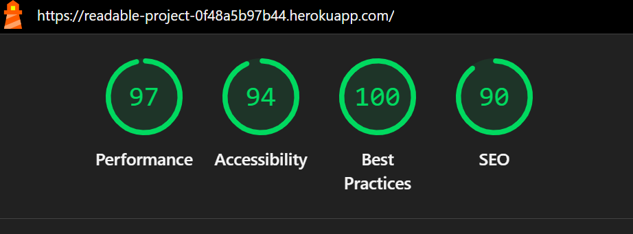
Book detail page- mobile results:
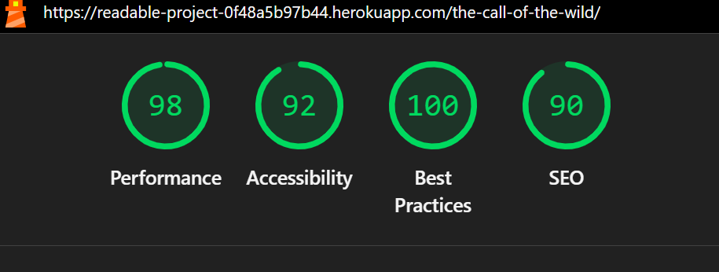
Book detail page- desktop results:
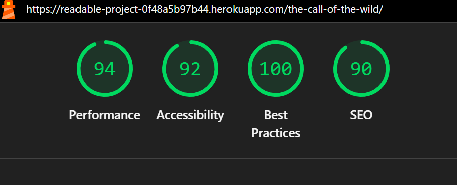
Contact page- mobile results:
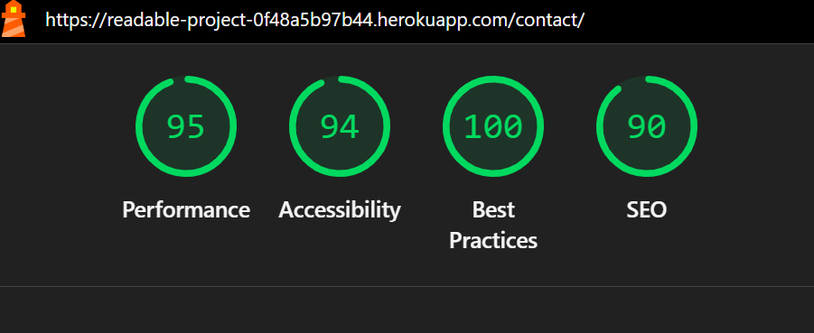
Contact page- desktop results:
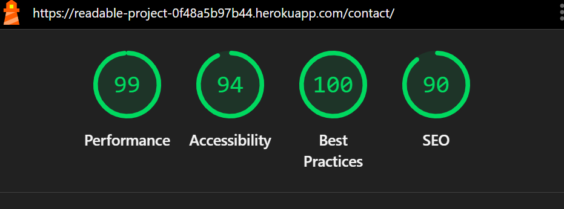
 
## Future developments
- Add book cover images
- Add wishlist functionality

## Development & Deployment
- The site was built using Visual Studio Code connected to GitHub via the steps below:
    - Created a local project folder in VS Code and a GitHub repository with the same name
    - Copied the GitHub commands to 'create a new repository on the command line'
    - Pasted and ran these through a new terminal in VS Code
        - This initialised git, made a readme file and pushed a first commit to GitHub

- A virtual environment, Django project and app were created and activated via the steps below:
    - Chose ‘Python: Create environment...’ from the VS Code command palette
    - Selected ‘Venv’, ‘Python 3.12’ and ‘requirements.txt’ to install dependencies
    - Added ‘.venv’ to the ‘.gitignore’ file to exclude it from version control
    - Ran the following commands to install Django, list dependencies, and start a new project:
        - pip3 install Django~=4.2.1
        - pip3 freeze local > requirements.txt
        - django-admin startproject readable .
    - Started the new app by running: python manage.py startapp catalogue
    - Added this to the INSTALLED_APPS in settings.py

- Throughout the project, changes made in VS Code were regularly saved and shared by:
    - Entering 'git add .' into a terminal to stage all changes
    - Entering 'git commit -m' with a succinct summary message to commit the changes
    - Entering 'git push' to push all local changes to the project's remote GitHub repository

### Initial deployment
- The site was initially deployed to Heroku via the steps below:
    - Set DEBUG to False in settings.py and committed changes (repeated for every deployment)
    - Created a new app with the project name from the Heroku dashboard
    - Opened the Settings tab in the new app
    - Added a single config var with a key set to ‘DISABLE_COLLECTSTATIC’ and value of '1'

    - VS CODE: ensured a deployment-compatible server and both local and production hosting by:
        - Installing gunicorn by running: pip3 install gunicorn~=20.1
        - Adding a Procfile to the root directory and the code: web gunicorn readable.wsgi
        - Adding '.herokuapp.com' and '127.0.0.1' to the ALLOWED_HOSTS in settings.py

    - HEROKU: Selected the ‘Connect to GitHub’ deployment method in the Deploy tab
    - Searched for and selected the project repository name to establish the connection
    - Scrolled to 'Manual deploy' and selected 'Deploy branch' to build the live app
    - Above the tabs bar an 'Open app' link was provided to the hosted site

### Final deployment
- To maintain deployment-ready status as the project grew, a series of adjustments were needed:
#### Database
- The following steps were taken to connect to a new database and access the admin panel:
    - Created a PostgreSQL instance using the Code Institute login, emailed as a link
    - Pasted the url into a new env.py file as a setdefault("DATABASE_URL", ...)
    - Added env.py to the .gitignore to keep secure data from being pushed to GitHub
    - Connected the database by running:
        - pip3 install dj-database-url~=0.5 psycopg2~=2.9
        - pip3 freeze --local > requirements.txt
    - Imported env into the settings.py file to access the database url
    - Commented out the local sqlite3 database connection
    - Ran 'python manage.py migrate' to add default apps to the database
    - Ran 'python manage.py createsuperuser' and added details to login to the admin dashboard
- DEPLOYMENT: Added a DATABASE_URL config var to the Heroku app
#### Secret keys
- To secure the database, secret keys were generated and activated via the steps below:
    - Generated a random key and added it to a "SECRET_KEY" environment variable in env.py
    - Replaced the insecure SECRET_KEY in settings.py with the environment variable
- DEPLOYMENT: Added a SECRET_KEY config var to the Heroku app with a newly-generated key
#### Static files
- The following steps were taken to ensure static files loaded correctly on deployment:
    - Added a STATIC_ROOT path to 'staticfiles' underneath the STATIC_DIRS in settings.py
    - Installed whitenoise (to enable Heroku to run 'collectstatic' automatically) by:
        - Running 'pip3 install whitenoise~=5.3.0' and 'pip3 freeze --local > requirements.txt'
        - Adding the whitehoise MIDDLEWARE and backend STORAGES to settings.py
    - Ran 'python manage.py collectstatic' to create staticfiles directory and initial cache
    - Added 3.12 to .python-version file
- DEPLOYMENT: Removed DISABLE_COLLECTSTATIC config var from the Heroku app before re-deploying
#### Forms and HTTP methods
- Finally, the site was protected against Cross-Site Request Forgery by: 
    - Adding //localhost and //*.herokuapp.com domains to CSRF_TRUSTED_ORIGINS in settings.py
- DEPLOYMENT: This ensured that malicious sites would be prevented from tricking users' browsers into submitting unauthorised data to either the local or hosted site

## Credits
- Example code from the Code Institute 'I Think Therefore I Blog' walkthrough project
- Book information from [Penguin](https://www.penguin.co.uk/discover/articles/100-must-read-classic-books) and [Amazon](https://www.amazon.co.uk/books) 
